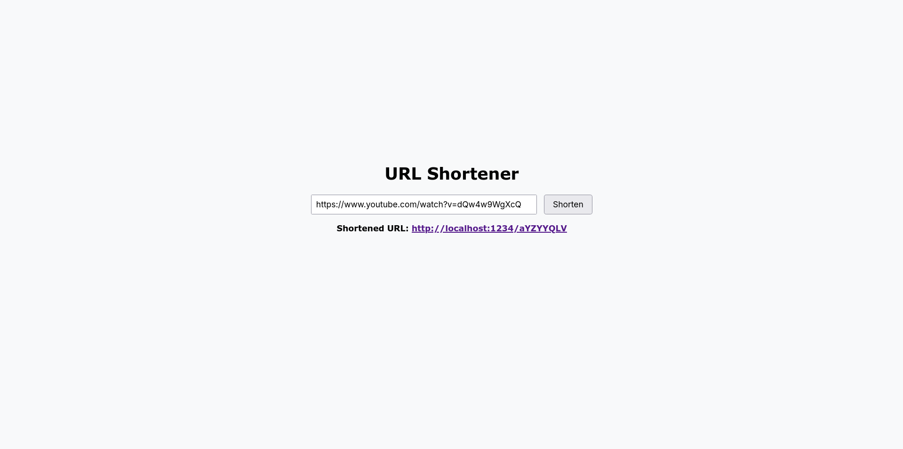

# URL Shortener

A simple URL shortener built with FastAPI, MongoDB and Redis.



## Prerequisites

Before running this application, ensure you have the following installed:

* Docker and Docker Compose (for containerized environment)

If you want to run locally:

* Python 3.13
* MongoDB
* Redis

## Environment Variables

This project relies on environment variables that you can configure in a `.env` file. A `.env.example` file is provided with all available variables and their default values — you can copy it using `cp .env.example .env`. Alternatively, you can skip this step and rely on the built-in defaults.

### 🔗 MongoDB Configuration

* `MONGO_URI`: URI for connecting to MongoDB
  (e.g., `mongodb://localhost:27017/` for local use or `mongodb://mongodb:27017/` in Docker).
* `MONGO_USERNAME`: MongoDB username (default: `admin`).
* `MONGO_PASSWORD`: MongoDB password (default: `secret`).
* `MONGO_DATABASE`: Name of the MongoDB database (default: `url_shortener`).
* `MONGO_COLLECTION`: Name of the MongoDB collection (default: `urls`).

---

### 🚀 FastAPI Application

* `API_HOST`: Host for the FastAPI application
  (default: `127.0.0.1` locally, `0.0.0.0` in Docker).
* `API_PORT`: Internal port for the FastAPI server (default: `8000`).
* `API_PORT_MAP`: External port mapping when running with Docker (default: `1234`).
* `RELOAD_ON_CHANGE`: Enables auto-reload on code changes
  (default: `true` locally, `false` in Docker).

---

### 🧠 Redis Cache

* `REDIS_HOST`: Redis host (default: `127.0.0.1`).
* `REDIS_PORT`: Redis port (default: `6379`).
* `REDIS_DB`: Redis database index (default: `0`).
* `REDIS_EXPIRATION_SECONDS`: Time-to-live for cached entries in seconds
  (default: `7200` seconds or 2 hours).


## Setup

You can run this project either in **Docker** (recommended) or **locally**.

### Docker Setup (Recommended)

1. Clone the repository:

   ```bash
   git clone https://github.com/danilo-alm/url-shortener.git
   cd url-shortener
   ```

2. Build and run the application with Docker Compose:

   ```bash
   docker-compose up --build
   ```

3. The frontend will be available at `http://localhost:1234` (or the port specified in your `.env`).

### Local Setup (Without Docker)

1. Install and start MongoDB

[Read the MongoDB Docs](https://www.mongodb.com/docs/manual/installation/)

2. Install and start Redis

[Read the Redis Docs](https://redis.io/docs/latest/operate/oss_and_stack/install/archive/install-redis/)

2. Clone the repository:

   ```bash
   git clone https://github.com/yourusername/url-shortener.git
   cd url-shortener
   ```

3. Install `uv`
   ```bash
   python -m pip install uv
   ```

4. Install dependencies and run
   ```bash
   uv run -- python -m app.run
   ```

5. The frontend will be available at `http://localhost:8000` (or the port specified in your `.env`).